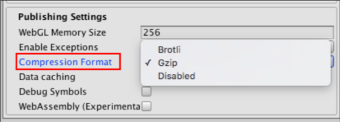
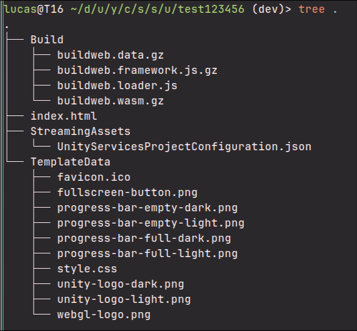

<!--Build this document using the command below-->
<!-- pandoc instructions.md -o out.pdf -->


<style>
.solo-image {
    max-width: 80%;
    margin: auto;
    display: block;
}
</style>

# Canvas Unity3D Player - Setup Guide 

This guide will explain how to set up and use your own instance of the Unity3D Canvas Player. 

**Unity3D Canvas player** (the player) in the context of this document refers to the combination of two pieces of software. 

There is a server application (the server), which is responsible for hosting Unity content and serving it to Canvas users. This is performed in real time and expected to be run **once per Canvas instance**. For example, one instance for rmit.instructure.com. Users will never need to directly interact with the server as the entire application is accessible through the frontend. 

In addition, there is a client application (the client), which is responsible for rendering all content from the server and accessed through Canvas. This handles not only the uploading and management of Unity applications, but the playback as well. 

 

## Important Concepts 

For an end user to consume a Unity application, it must first be uploaded by an **instructor**. Canvas instances manage instructors through their own mechanisms, and whether a user is an instructor is determined by whether they have write-access to a specific course.  

Uploaded builds can be modified at a later date *(currently WIP)* and deleted by the instructor who originally uploaded them. They can also be marked as private or restricted to a specific course *(also WIP)*.

Then, within the Canvas rich content editor, available Canvas applications can be embedded directly into Canvas pages. After this, the application is available for playback within the page in the same way that a regular video is on Canvas. 

## Preparing a Unity Build 

An instructor begins by exporting a **WebGL** build from Unity. More information can be found here. Currently, the player only supports **gzip compression** as the compression option, so make sure to select this when exporting your Unity build.  




 
Unity WebGL builds are generally self-contained and contain their dependent files within a single “Build” folder. In addition, the player currently **requires that all files within the Build folder start with the word buildweb**. Please ensure that all files within the Build folder follow this naming format or it is likely that your application will not embed properly. An example is shown below. *(This is a development implementation only, and is expected to be fixed later)*




## Setting up a Canvas Instance 

If you are just using an existing instance and not initialising your own, please skip to [Adding the Instance to Canvas](#adding-the-instance-to-canvas).

### Reverse proxy

Make sure if setting up your own instance that you set up https certificates. The recommended method is by using something like certbot to manage certificates, and nginx to let the server communicate internally using http. These are out of the scope of this guide, as they are not directly interacted with by the application.

With that being said, **https is not optional**, and is required for Canvas to communicate with external apps. If it isn't used, Canvas will refuse most web requests to the application.

### Cloning the Repositories 

To get started, clone the following 2 repositories. Unless you are familiar with NPM environment workspaces, it's recommended to use the following clone commands. These will set up repositories with specific names. 

```bash
mkdir canvasunity
cd canvasunity
git clone https://github.com/lucas-rodiadis-rmit/unity3d-canvas-player-server.git ./server
git clone https://github.com/lucas-rodiadis-rmit/unity3d-canvas-player-client.git ./client
ls
# client/  server/      <-- Need both of these with these folder names
```

If support for the latest features is required, then the ``dev`` branch should be used for each repository. The following commands will switch both repositories to the dev branches.

```bash
cd ./server
git checkout dev
cd ../client
git checkout dev
cd ..
```

### Installing dependencies

Next, install all of the required dependencies for each repository and create a .env file for each one.

```bash
cd ./server
npm i
touch ./.env

cd ../client
npm i
touch ./.env

cd ..
```
 

### Configuration

Next, we need to set the environment variables. Using the text editor of your choice (we will assume nano in this guide), write the environment variables to each ``.env`` file. **Do not just blindly copy the default values in this guide, as the variables will change depending your domains**.

#### Server Vars
```bash
nano ./server/.env
```
```toml
### ./server/.env ############################

# The port which the server will run on. 8080 for production
PORT=8080 

# The domain which the server will run on
DOMAIN_URL=https://canvasunityplayer.hudini.online 

# Disable seed data for production
SEED=false
```


#### Client Vars
```bash
nano ./client/.env
```
```toml
### ./client/.env ############################

# The base URL which the frontend will be served from (almost always /)
VITE_CLIENT_URL_BASE=/

# The base URL of the API  (should be your domain URL + "/api/v1")
VITE_API_URL=https://canvasunityplayer.hudini.online/api/v1
```


### Building and Running

Finally, we are going to build and run the application. For basic usage, running the ``build_and_run.sh`` script in the server folder should suffice. This will build the client, the server, link them together and then start running the app on the set port. Before running the script, make sure to **update the variables inside** to match your ``.env`` files.

```bash
cd ./server
./build_and_run.sh
```

This script can also be used to **restart** the server, as it will kill any programs currently running on port 8080.

If everything worked successfully, you should see something like the following screenshot.


```bash
canvasunity@thor18:~/dev/server$ ./build_and_run.sh

> runtime@0.0.0 build
> tsc -b && vite build

vite v6.2.5 building for production...
58 modules transformed.
dist/index.html                   0.88 kB | gzip:  0.47 kB
dist/assets/index-BbcIhfxK.css    7.96 kB | gzip:  2.14 kB
dist/assets/index-DJg_nZri.js   237.69 kB | gzip: 76.02 kB
built in 2.65s

> unity3d-canvas-player@0.0.0 build
> tsc && cpx "src/resources/**/*" dist/resources && cpx "public/**/*" dist/public


> unity3d-canvas-player@0.0.0 start
> node dist/server.js

Using config:  {
  port: 8080,
  nodeEnv: 'development',
  domainUrl: 'https://canvasunityplayer.hudini.online/',
  storageDir: '/home/canvasunity/dev/server/storage',
  unityProjectsDir: '/home/canvasunity/dev/server/storage/unity_projects',
  resourcesDir: '/home/canvasunity/dev/server/dist/resources'
}

Initialising Database.
Database is up to date with migration 2_tokens.sql
# Seed data logs appear here if SEED is enabled
Server running on port 8080
```

If errors arise related to environment variables, the error messages should indicate which file they must be set in.

### Extending the run script

In the future, the server will be implemented as a systemd service which can be started and stopped. For now, one solution for server sessions to persist through user ssh sessions is tmux.

```bash
sudo apt install tmux   # Install tmux if not installed

tmux attach || tmux     # Create a new tmux session, or join the existing one
./build_and_run.sh      # Run the server
^b d                    # Press ctrl+b to trigger tmux, then d to detach
```

This tmux session will persist throughout logins, and can even be used by multiple users at the same time. Because of this, care should be taken when accessing the instance.

Tmux is an extremely capable piece of software capable responsible for powerful many different workflows, and if its use here seems interesting, you should [check it out sometime](https://github.com/tmux/tmux/wiki/Getting-Started).

### Conclusion

Once you have set up the instance, you're ready to upload Unity projects. Check out the separate usage guide for the next steps.
