<!--Build this document using the command below-->
<!-- pandoc instructions.md -o out.pdf -->

# Canvas Unity3D Player - Usage Guide 

This guide will explain how to use the Unity3D Canvas Player. This document assumes that **an instance has already been setup** with the player up and running. If this is not the case, please refer to the separate setup guide document.

## Important Concepts 

For an end user to consume a Unity application, it must first be uploaded by an **instructor**. Canvas instances manage instructors through their own mechanisms, and whether a user is an instructor is determined by whether they have write-access to a specific course.  

Uploaded builds can be modified at a later date *(currently WIP)* and deleted by the instructor who originally uploaded them. They can also be marked as private or restricted to a specific course *(also WIP)*.

Then, within the Canvas rich content editor, available Canvas applications can be embedded directly into Canvas pages. After this, the application is available for playback within the page in the same way that a regular video is on Canvas. 

## Adding the Instance to Canvas 

### Navigating to the App Config Page

After starting up your instance, you need to register your app with Canvas as an external app. This will allow you to embed it in other pages within Canvas. First, let's check if the app has already been installed.

In Canvas, go to the course which you would like to add the player to, and navigate to the settings for the course. If you are unable to see the settings, you might not have permissions to register the app. Typically, access is granted to instructors and intervention from an administrator is not necessary.

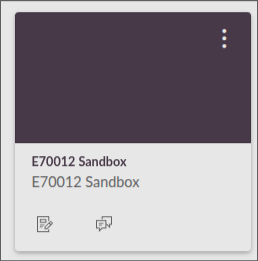
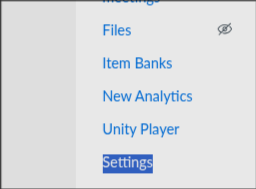

\
From settings, navigate to the apps tab and click on View App Configurations. 

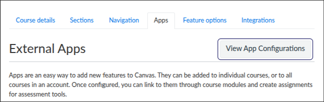

### IMPORTANT WARNING
The registered app we are going to add here can serve multiple Unity applications. As such, **if the Unity player has already been added to your course, DO NOT add it again**, and skip ahead to [Uploading and Embedding Unity Applications](#uploading-and-embedding-unity-applications).

### Adding the XML Config

***NOTE: From here on out in the guide, ``https://canvasunityplayer.hudini.online/`` will be used as your DOMAIN. If your domain is a different URL, use that instead.***

\
To add the app to Canvas, navigate to <https://canvasunityplayer.hudini.online/register>. This will allow you to generate xml which adds the tool to Canvas. 

While the tool reacts automatically to changes that you make, the default options are optimised out of the box to satisfy 99% of cases. Otherwise, they are documented in the Canvas LTI API, which is out of the scope of this document due to it being a can of worms in its own right.

If the copy XML button doesn't work (not that we've ever seen it not work), you can just copy it out of the text entry box.

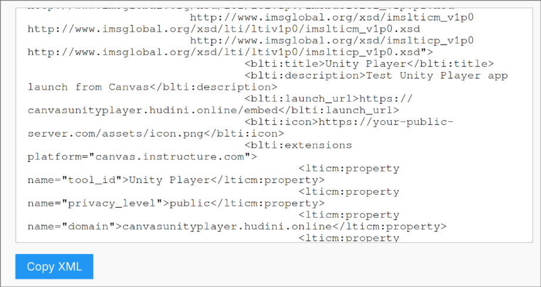

Next, click on the ``[+ App]`` button to add a new app to Canvas. Choose paste XML, then give your app a name, paste the generated xml and click ``[Submit]``.

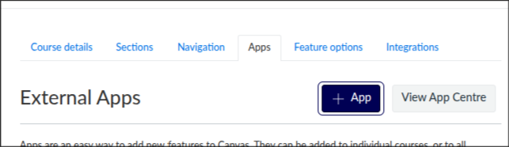
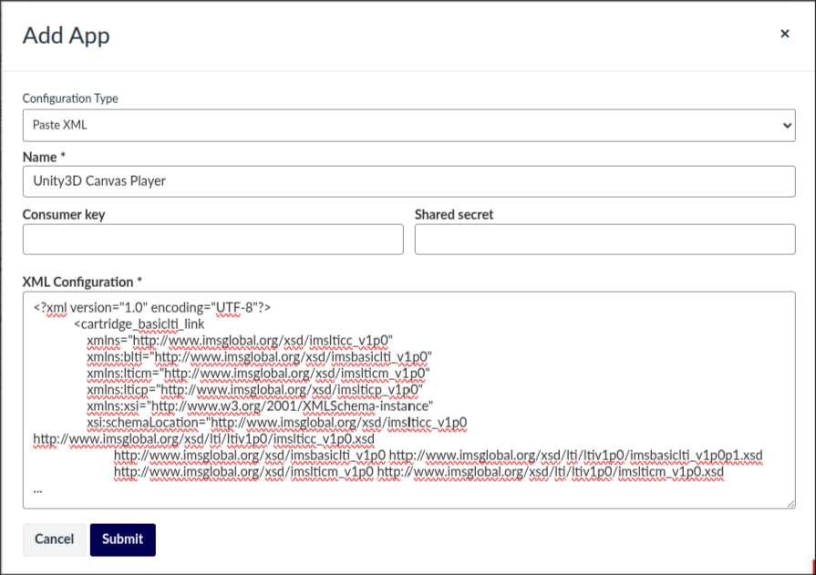

\
If Everything completed successfully, you should have a new app in the list with a name matching what you put in the Canvas ``Name`` field.

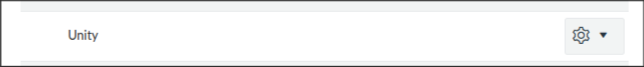

## Uploading and Embedding Unity Applications

### Launching the Embedder

After registration, which only happens once, all other configurations is performed within a *"launch"* of the application.

To upload an app, we are going to attempt to add an embed. Create a new page module on Canvas (or re-use an existing one), and click on Tools, then Apps. If Unity doesn't show here, click on All Apps then search for it.

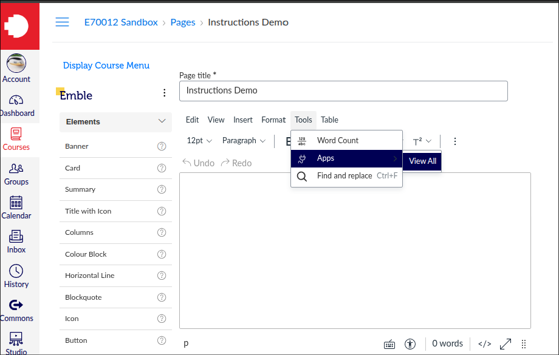

Now that the app has been launched, we can see the main UI. From here, you can select the Unity project which you would like to embed into the Canvas page. If you already have a Unity project on the instance which you would like to embed, skip ahead to [Embedding a Unity Project](#uploading-a-unity-project)  

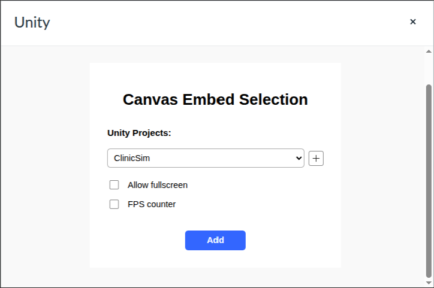

### Uploading a Unity Project

If you click on the ``[+]`` on the embed homepage, you'll be taken to the upload page. From here, you'll need to select a Unity build from your disk and upload it. Make sure to select this from the **root** folder of the exported build, meaning, **don't upload your Build folder directly**, but instead the folder containing it. If you don't, there is no guarantee that the client will be able to fetch the files it needs at runtime.

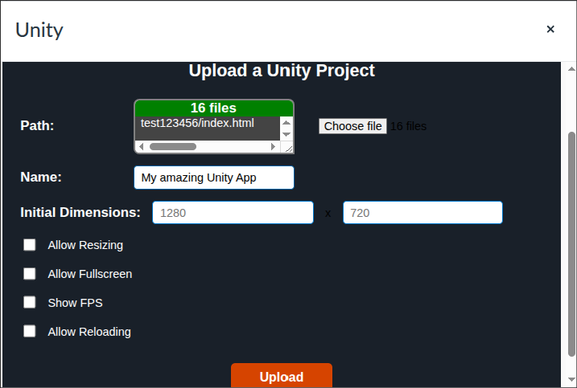

Make sure to give your app a **name** also. This name must be unique from other uploaded Unity apps on the instance. To see a list, check the original embed page.

After you've configured the app to your liking, click the ``[Upload]`` button. The app will let you know upon successful completion of the upload. 

### Embedding a Unity Project

In order to embed a Unity app into Canvas, simply select it from the list, along with any options that you would like, and then click the ``[Add]`` button.

If all went well, you should see your app embedded right into the Canvas page.

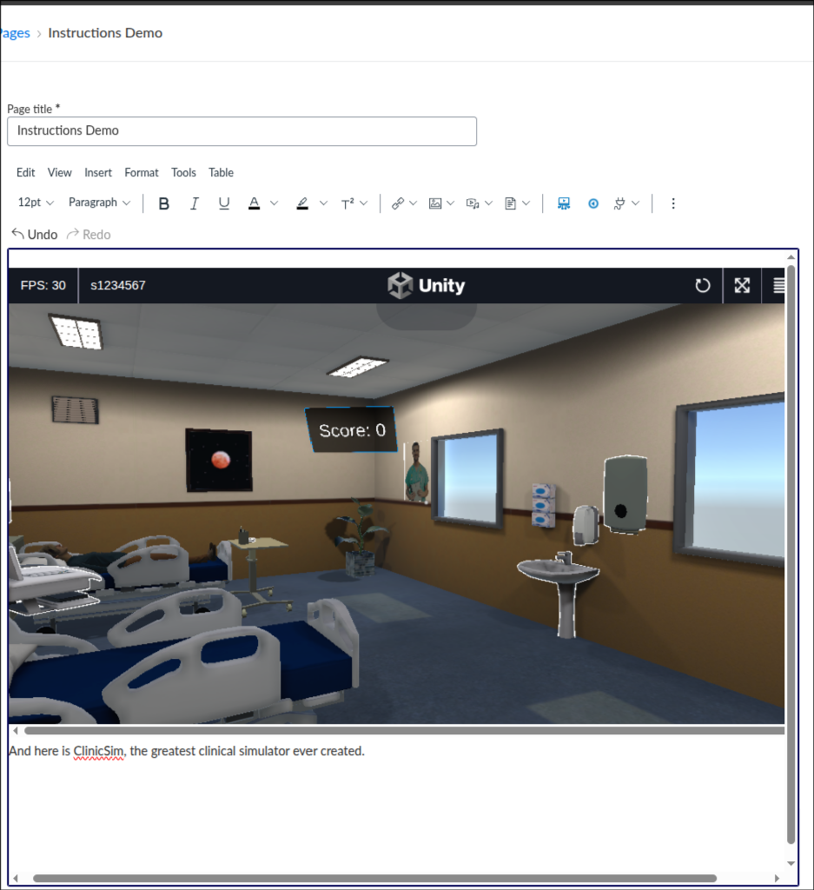
